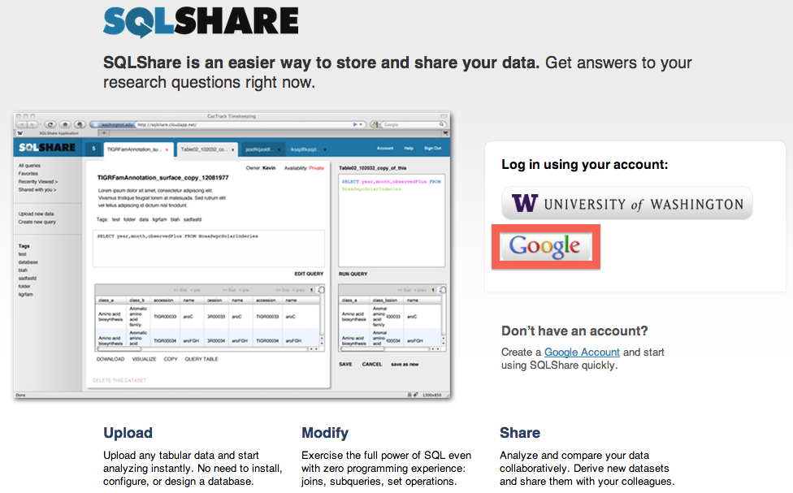
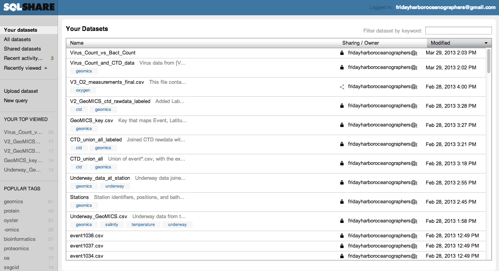
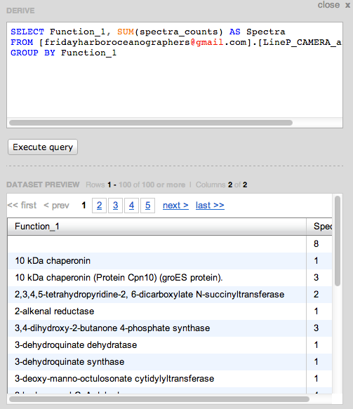
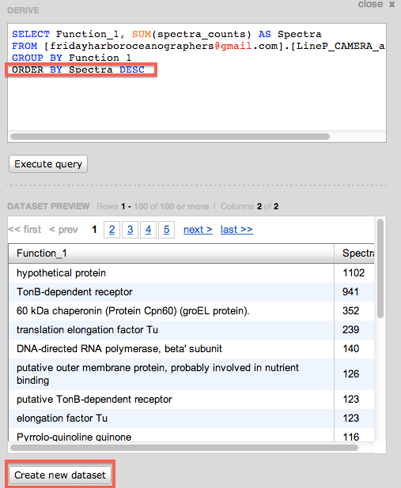

# SQLShare GeoMICS tutorial

## Logging into SQLShare

1. Visit the [SQLShare website](https://sqlshare.escience.washington.edu).
2. Select login using the Google account button. 
3. Sign in using the `FridayHarborOceanographers@gmail.com` username and with the password that Ginger sent you.
4. If successful, you should see the main SQLShare page with the list of the most recently modified datasets. 

## Uploading data

If the dataset you want to process is not already in SQLShare, you need to upload it.

### Preparing the data
* Start with [Francois](http://armbrustlab.ocean.washington.edu/people/ribalet)' template Excel spreadsheet, which you can download by [clicking here](GeoMICS_data.csv).
  * Some browsers automatically visualize the spreadsheet instead of downloading the file. In this case, right-click [the link](GeoMICS_data.csv) and `Save as` or `Download link as`.
* Fill in your data in the CSV file.
* Column names should be descriptive, should include units, and, if possible, you should avoid special characters such as square brackets: `[ ]` and math symbols: `+ - %`.
* Rename the file from `GeoMICS_data.csv` to something descriptive and identifying (and unique), for example `Ribalet_SeaFlow_growth_rate_v3.csv`.

### Uploading the data through SQLShare
* Click the `Upload dataset` button on the left side of the page.
* In **Step 1**, click `Select File` and choose the renamed CSV file which contains your data (`Ribalet_SeaFlow_growth_rate_v3.csv` in our example). 
* In **Step 2**, you will see a preview of the dataset. If it parsed correctly and you have followed our instructions you should not need to do anything here. Just click `Next` at the bottom right.
* In **Step 3**, you will be asked to describe your dataset and add tags.
  * *Description*: Please provide a brief one-sentence description of what the dataset contains. Then add keywords that will be useful in searching for this dataset, e.g., `iron`, `DOC`, `nutrients`, `protein`, etc.
  * *Tags*: At a minimum add the tag `geomics` so that this dataset is part of the `geomics` collection on SQLShare. Please also choose one of: `organic`, `inorganic`, `omics`, and `underway`. You can also add keywords as tags as you feel appropriate.
  * *Share this dataset with everyone - (Public or Private?)*: You can also select whether this data should be globally public on SQLShare, or private. For now, most GeoMICS participants have opted to make their datasets shared only with the GeoMICS team (*uncheck the box*).
  * Finally, click `Save` at the bottom right. 

## Finding existing datasets

The easiest way to find datasets in SQLShare is through the keyword search at the top right, labeled `Filter by keyword`. Note that this search will search in: the `filename`, the `description`, and the `tags` -- which is why you should choose these carefully when uploading data. 

## Getting back to your home page

If you want to get back to the "home page" in SQLShare, simply click the `Your datasets` link at the top left of the page.

## Querying the data in SQLShare

Here is a list of example analyses conducted using the GeoMICS datasets in SQLShare. We hope that these will serve as templates that you can use to write your own queries.

### Example: Analyzing protein function

[Bob Morris](http://morrislab.ocean.washington.edu/?q=RobertMorris) uploaded datasets that analyzed protein expression in the surface water at the -omics stations. You can see these data by viewing the dataset here: [[fridayharboroceanographers@gmail.com].[LineP_CAMERA_annotation]](https://sqlshare.escience.washington.edu/sqlshare#s=query/fridayharboroceanographers%40gmail.com/LineP_CAMERA_annotation). You could also find this dataset by searching for `protein` or `CAMERA` as described above.

Suppose that we want to find the **most commonly expressed protein functions**. In Bob's dataset, the `spectra_counts` column indicates the number of times each protein was found, and the `Function_1` column indicates the most popular function attributed to those proteins.

To describe the computation in English: For each unique function (from the `Function_1` column), we want to add up the corresponding spectra counts (`spectra_counts`). The SQL translation of this query is as follows:

    SELECT Function_1, SUM(spectra_counts) AS Spectra
    FROM [fridayharboroceanographers@gmail.com].[LineP_CAMERA_annotation]
    GROUP BY Function_1

The `GROUP BY Function_1` part of this query says that for each unique value of `Function_1`, SQLShare will create a new group of measurements. Within each group, the `SUM(spectra_counts) AS Spectra` shows that we will add up all the spectra counts within each group, and name the resulting sum `Spectra`. Finally, the `FROM` part of the query identifies which dataset this query will analyze.

####To create a dataset using this query in the SQLShare interface:

1. First select [Bob's original dataset](https://sqlshare.escience.washington.edu/sqlshare#s=query/fridayharboroceanographers%40gmail.com/LineP_CAMERA_annotation). 
2. Then click the `Derive dataset` button.
3. Enter the query in the `DERIVE` panel, and click `Execute query`.
   a. If you made any typos, or SQLShare experienced an error trying to compute the result, you will see an Error message below. In this case, we mistyped the `Function_1` column name.
      
4. When the query executes successfully, you will see a preview of the result.
   a. By default, SQLShare sorts by the first column, so in this case we will see a blank cell (for a missing function group) at the first row.
      
   b. You may want to sort the values in the dataset differently, e.g., to find the most abundant protein functions first. You can sort the output using the `ORDER BY` statement, e.g., `ORDER BY Spectra DESC`. Here, `DESC` means "in descending order"; you can also use `ASC` for ascending order. Here is the final SQL query:
   
          SELECT Function_1, SUM(spectra_counts) AS Spectra
          FROM [fridayharboroceanographers@gmail.com].[LineP_CAMERA_annotation]
          GROUP BY Function_1
          ORDER BY Spectra DESC

      
5. Click on `Create new dataset` to save this result. As before, please give the new dataset an informative `Name`, `Description`, and `Tags`. Always include the `geomics` tag. Then you can save the result and a new dataset will be created. You can see the result by clicking [here](https://sqlshare.escience.washington.edu/sqlshare#s=query/fridayharboroceanographers%40gmail.com/Protein_Function_Example).

## Joining datasets together

A common task (and indeed, one of the big features of SQLShare!) is merging data in different datasets together. Here is an example task from Jagruti Vedamati: **_I want to look at O2 data along with the total dissolved and particulate metals_**.

1. Find the relevant datasets: Using the `Filter dataset by keyword` box described earlier, search for `O2` (to find the oxygen data) and `metals` (to find the metals data), and inspect the resulting datasets. Note that these searches work because these datasets have well-chosen names, descriptions, and tags. You should find:
   * Oxygen data: [[fridayharboroceanographers@gmail.com].[V2_O2_measurements_final.csv]](https://sqlshare.escience.washington.edu/sqlshare#s=query/fridayharboroceanographers%40gmail.com/V2_O2_measurements_final.csv)
   * Metals data: [[fridayharboroceanographers@gmail.com].[V2_GEOMICS_Fe-Cu-Mn-Zn-Vedamati.csv]](https://sqlshare.escience.washington.edu/sqlshare#s=query/fridayharboroceanographers%40gmail.com/V2_GEOMICS_Fe-Cu-Mn-Zn-Vedamati.csv)
2. Figure out how the two datasets can be matched up. Usually we want to take samples at the same `Station` and `Depth`, or `Event` when these are not available.
3. The SQL command to merge datasets is called `JOIN`. It can be used as follows:

       SELECT *
       FROM [fridayharboroceanographers@gmail.com].[V2_GEOMICS_Fe-Cu-Mn-Zn-Vedamati.csv] metals
       JOIN [fridayharboroceanographers@gmail.com].[V2_O2_measurements_final.csv] oxygen
         ON (metals.[Station] = oxygen.[station]
             AND metals.[Depth..m.] = oxygen.[Depth])
   
   There are a few interesting parts of this statement:
   a. In the previous example, we explicitly listed which columns we wanted (`Function_1` and `Spectra`). In this example, `SELECT *` means select all columns in both datasets.
   b. We can give the individual datasets a shorter name (`metals` and `oxygen` in this example) so that we don't have to type the full `[fridayharboroceanographers@gmail.com].[long_dataset_name]` every time.
   c. We say that we want to `JOIN` datasets `ON` a particular condition. In other words, we take the pairs of rows (one from the `metals` dataset and one from the `oxygen` dataset) where the `ON` condition is true.
      1. In this case, we require them to match **exactly** in both _Station_ (`metals.[Station] = oxygen.[station]`) and _Depth_ (`metals.[Depth..m.] = oxygen.[Depth]`).
      2. Note that the column names are slightly different in the two datasets and thus our code uses the specific name for each dataset.
      3. If the _Depth_ values did not match exactly between the two tables, we could instead join "close" samples, e.g., if "the depths are within 5 meters": `ABS(metals.[Depth..m.] - oxygen.[Depth]) <= 5`
4. Once complete, save the dataset as in the previous example.

You can see the joined Oxygen and Metals dataset here: [[fridayharboroceanographers@gmail.com].[Metals_and_Oxygen]](https://sqlshare.escience.washington.edu/sqlshare#s=query/fridayharboroceanographers%40gmail.com/Metals_and_Oxygen).

## Troubleshooting
We will fill this in as the questions come.

Please mail [Daniel Halperin <dhalperi@escience.washington.edu>](mailto:Daniel Halperin <dhalperi@escience.washington.edu>) when you have issues or successes! :)